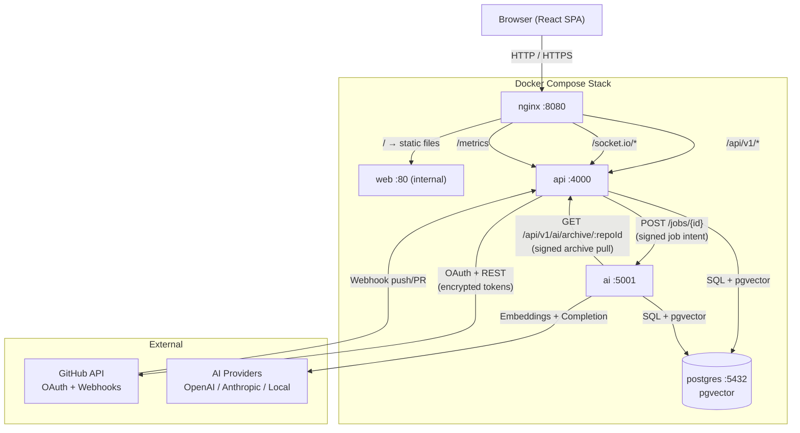
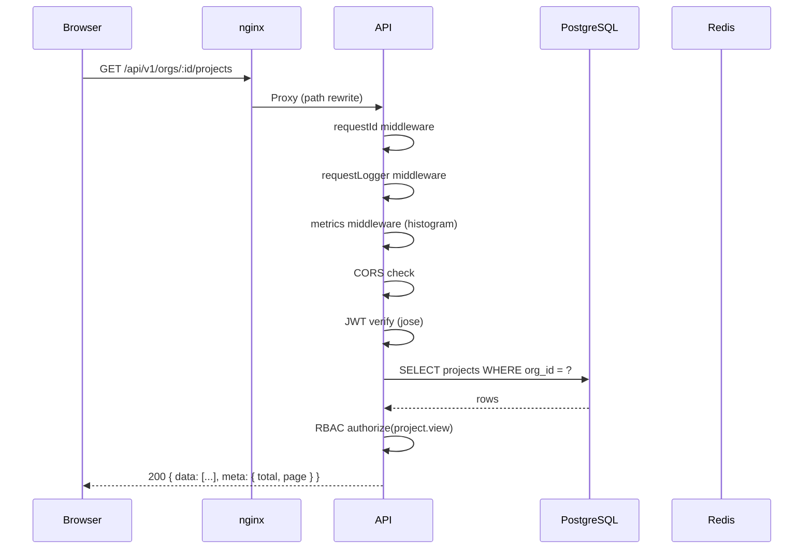
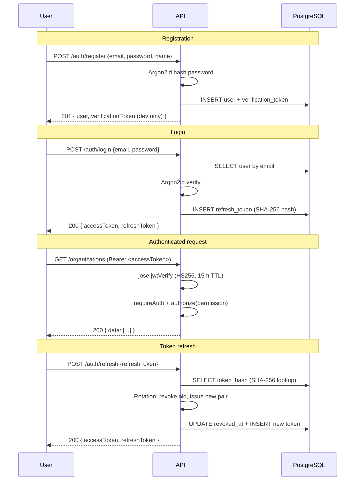
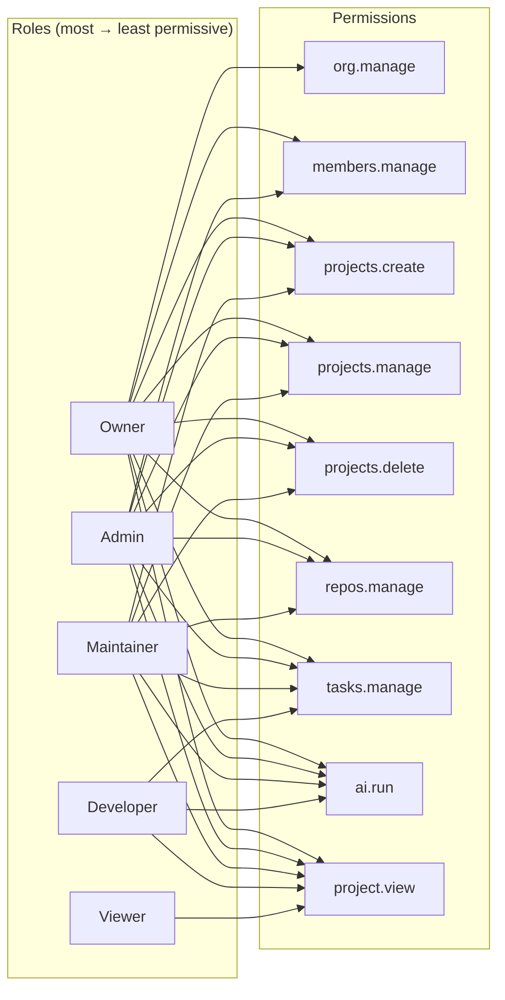
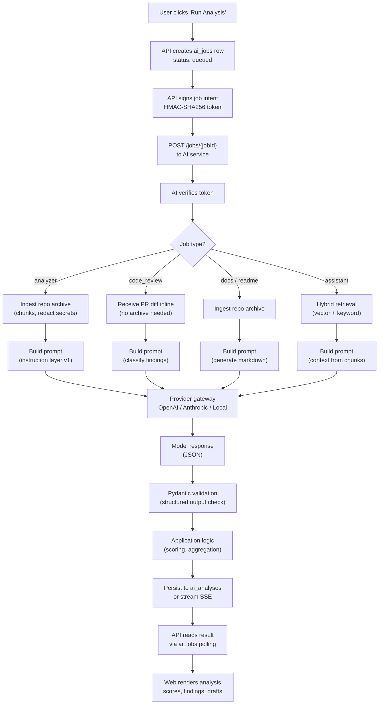
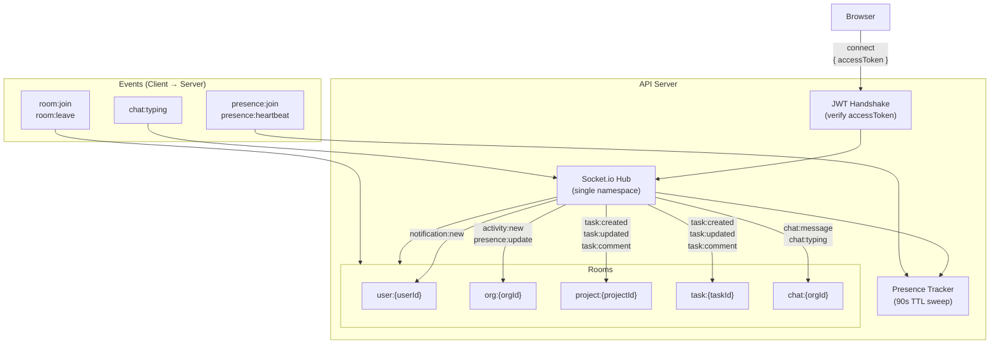
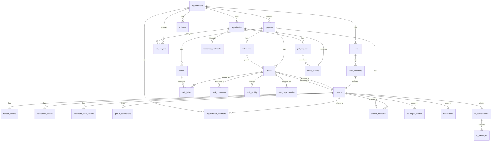
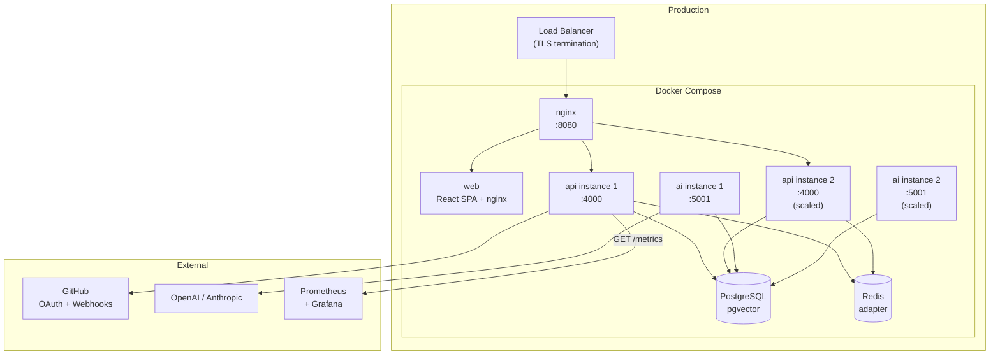

# Architecture Diagrams

Visual diagrams for the DevForge system. All diagrams use
[Mermaid](https://mermaid.js.org/) syntax and render in GitHub's
markdown viewer.

---

## 1. System Architecture

High-level view of how the five services connect.

**Key invariant:** The browser never talks to the AI service directly.
All AI requests flow through the API, which signs job intents and holds
credentials server-side.

---

## 2. Request Lifecycle

How a typical API request is processed.

---

## 3. Authentication & Authorization Flow

**Refresh token rotation:** Replaying a rotated or revoked token
revokes the entire token family (reuse detection).

---

## 4. RBAC Permission Matrix

RBAC is composed: org role + project role → the more permissive wins.

---

## 5. AI Pipeline Flow

---

## 6. Real-Time Architecture (Socket.io)

**Rooms are server-authorized:** the hub verifies org/project membership
in the database before allowing a join. Client-side events are never
trusted for authorization.

---

## 7. Data Model (ERD)

Simplified entity-relationship diagram. See
[data-model.md](./data-model.md) for full column definitions.

---

## 8. Deployment Topology

**Scaling notes:**
- API and AI services are stateless (JWT-based sessions).
- For multi-instance, swap in the Socket.io Redis adapter by setting
  `REDIS_URL`.
- PostgreSQL can be replaced with a managed service (RDS, Supabase).

---

*See also: [system-overview.md](./system-overview.md) ·
[backend-architecture.md](./backend-architecture.md) ·
[frontend-architecture.md](./frontend-architecture.md)*
